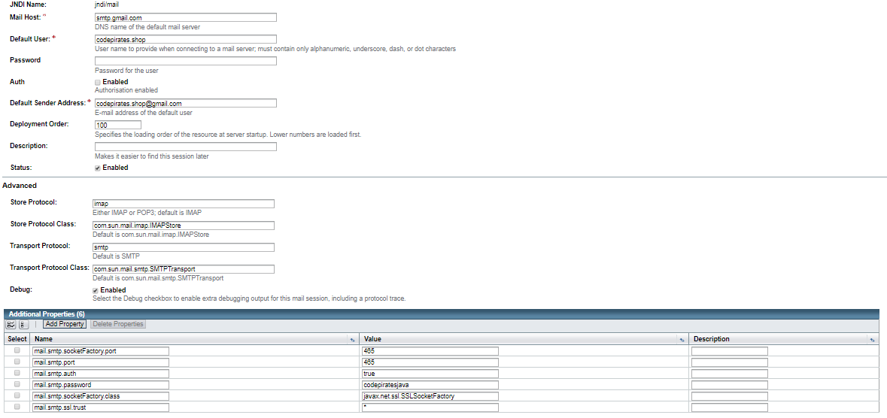
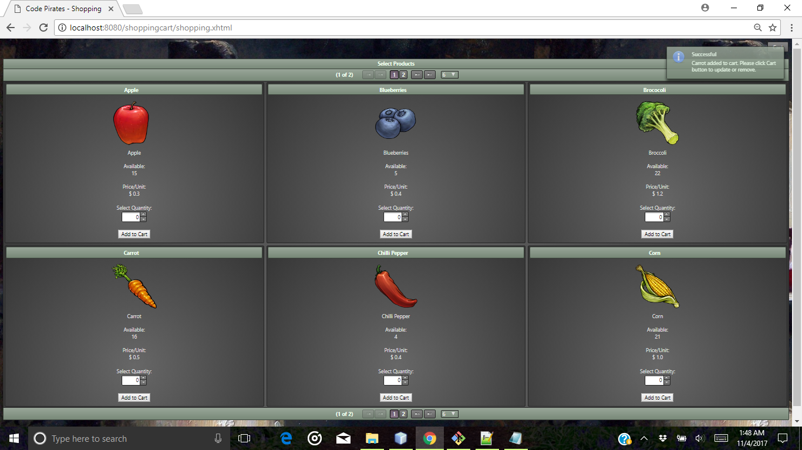
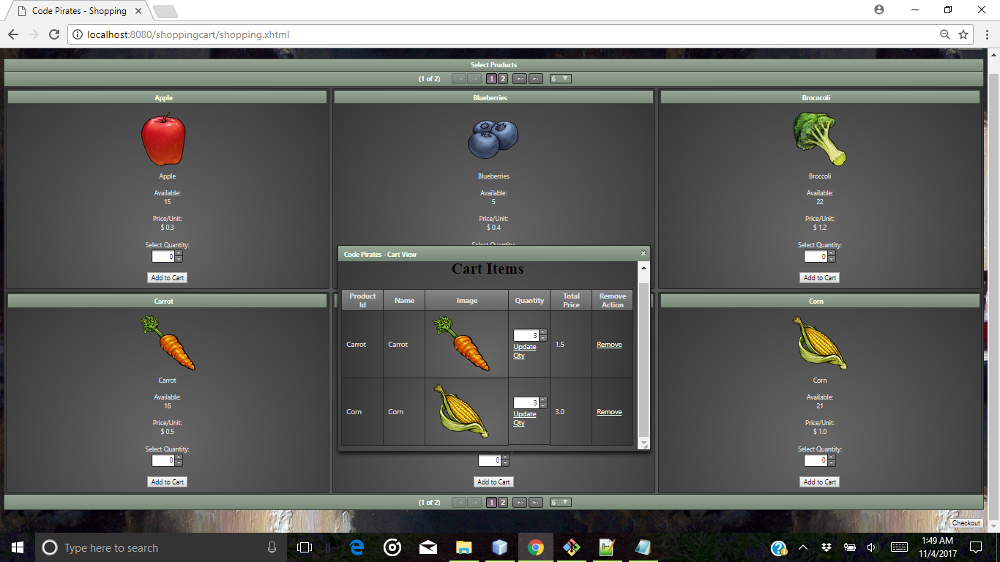
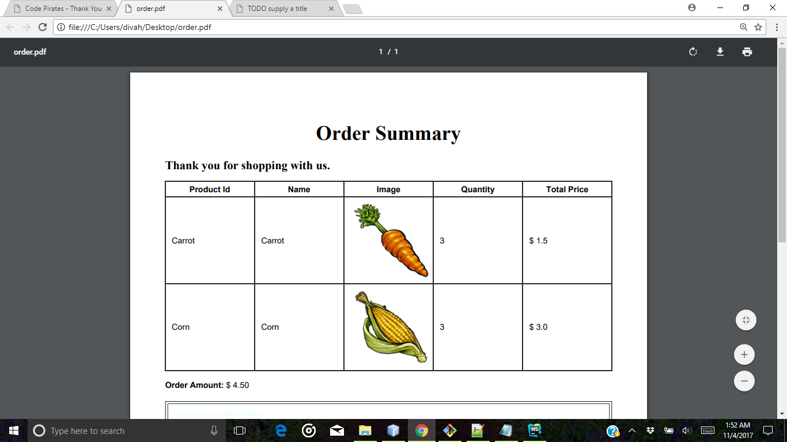
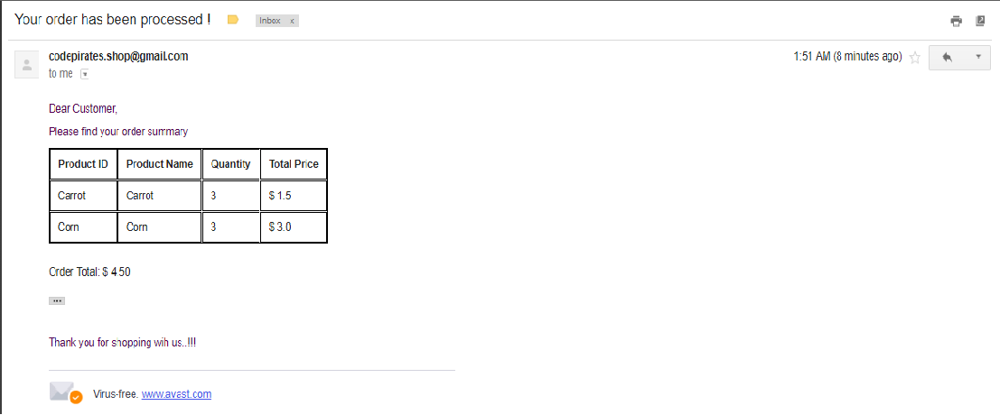
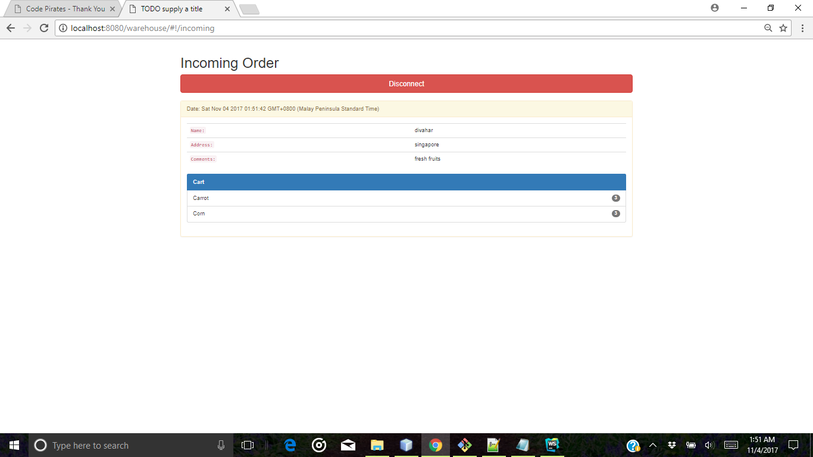

# Shopping Cart - Codepirates
This application is useful for shopping fruits and vegetables online. This application has the following features

  - Shopping products (Add to Cart)
  - Checkout products
  - Generation of Invoice in PDF
  - Email customer about the order summary

### Technology used

Codepirates shopping cart uses a number of technological features as given below:

* JSF 
* Primefaces 6.1
* EJB
* Pdf generation using IText and CoreRenderer
* Mail using JavaMail API
* Filters for application security

### Installation and Configuration

Database scripts is available in misc folder

DataSource Name: jdbc/ejava
JMS Queue: 	jms/warehouseQueue
JavaMail Sessions



Dependent JAR

```sh
primefaces 6.1.jar 
itext-2.0.8.jar
core-renderer-R8pre2.jar
afterdark-1.0.10.jar
```
Database scripts are included in the repository and is required for execution.

### Application flow with important screen prints

Adding to cart


Cart Items


Order Summary PDF


Email


Warehouse Queue

